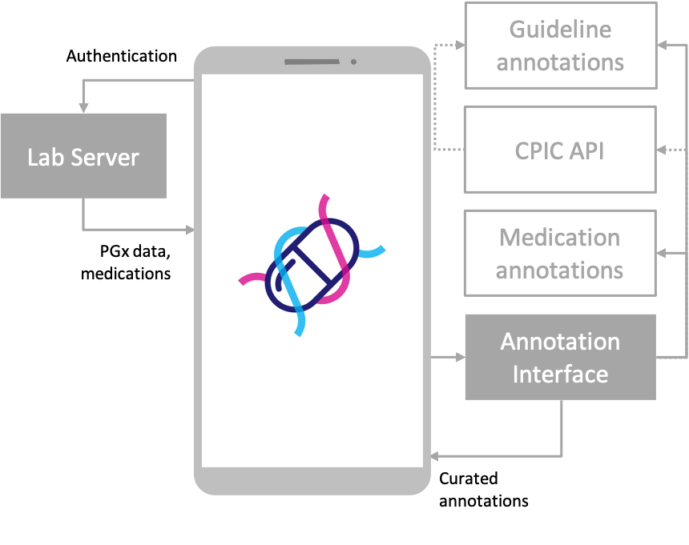

# Pharmaceutical insights tailored to your personal genome

PharMe is a resource for personalized pharmacogenomic information developed
within the context of a bachelor project at Prof. Böttinger's chair
*[Digital Health - Personalized Medicine](https://hpi.de/en/research/research-groups/digital-health-personalized-medicine.html)*
at [HPI](https://hpi.de).

See our [glossary](./docs/GLOSSARY.md) for terms commonly used within this
project.

## System status

| System component                                          | CI/CD                           | Code Coverage           |
| --------------------------------------------------------- | ------------------------------- | ----------------------- |
| 🧑‍💻 [Annotation Interface](./anni)                 | ![GitHub Workflow Status][AI_B] | ![Codecov branch][AI_C] |
| 📱 [App](./app)                                           | ![GitHub Workflow Status][AP_B] | ![Codecov branch][AP_C] |
| 🧪 [Lab Server](./lab-server)                             | ![GitHub Workflow Status][LS_B] | ![Codecov branch][LS_C] |

## Architecture

## 🤝 Contributing

Contributions, issues and feature requests are welcome. Please read our
[Contribution Guide](CONTRIBUTING.md) to get started.

<!-- References to badges -->
<!-- This won't be visible, keep it at the bottom of the file. -->
<!-- Build -->
[AI_B]: https://img.shields.io/github/actions/workflow/status/hpi-dhc/pharme/anni.yml?branch=issue/513-native-version-control&color=B079FF&label=Build&logo=github&logoColor=B079FF&style=for-the-badge
[AP_B]: https://img.shields.io/github/actions/workflow/status/hpi-dhc/pharme/app.yml?branch=main&color=7277FF&label=Build&logo=github&logoColor=7277FF&style=for-the-badge
[LS_B]: https://img.shields.io/github/actions/workflow/status/hpi-dhc/pharme/lab-server.yml?branch=main&color=769FFF&label=Build&logo=github&logoColor=769FFF&style=for-the-badge
<!-- Coverage -->
[AI_C]: https://img.shields.io/codecov/c/github/hpi-dhc/pharme/main?color=B079FF&flag=anni&label=Coverage&logo=codecov&logoColor=B079FF&style=for-the-badge&token=1Q3F9M0SJN
[AP_C]: https://img.shields.io/codecov/c/github/hpi-dhc/pharme/main?color=7277FF&flag=app&label=Coverage&logo=codecov&logoColor=7277FF&style=for-the-badge&token=1Q3F9M0SJN
[LS_C]: https://img.shields.io/codecov/c/github/hpi-dhc/pharme/main?color=769FFF&flag=lab-server&label=Coverage&logo=codecov&logoColor=769FFF&style=for-the-badge&token=1Q3F9M0SJN
