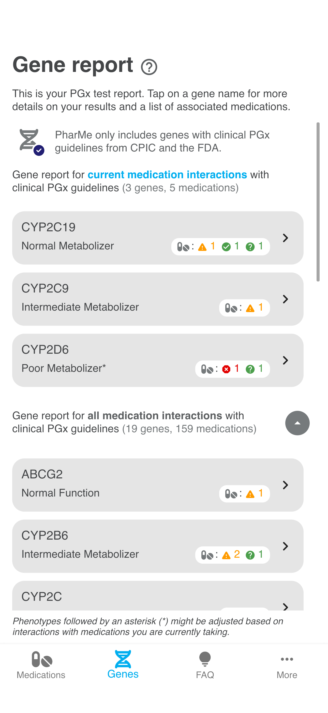

# App

The app displays user-specific [PGx](../docs/GLOSSARY.md) information.

Once the user imports their genomic data into the app,
[PGx](../docs/GLOSSARY.md) guidelines matching the user's genetic profile are
displayed.

Users can review their gene results [(a), (b)], search for medications (c), and
receive information about whether a medication can be used at standard dose or
if the treatment may need to be changed (d).

Any treatment changes should be approved by a pharmacist or physician as well.
To inform the physician of the [PGx](../docs/GLOSSARY.md) results, the
application offers to export a detailed description.

PGx report | Gene details | Medication search | Medication details |
:-: | :-: | :-: | :-: |
(a) | (b) | (c) | (d) |
 |  |  |  |

_Please note that these screenshots might not represent the latest app version._

_For more app screens, please refer to the_
_[documentation](../docs/App-screens.md)_

## Getting Started

See our [Contribution Guide](CONTRIBUTING.md) to get started.
