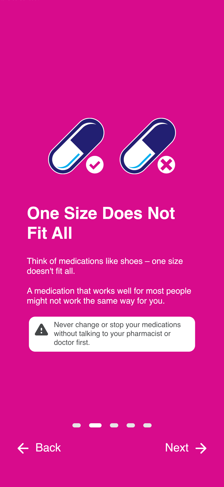
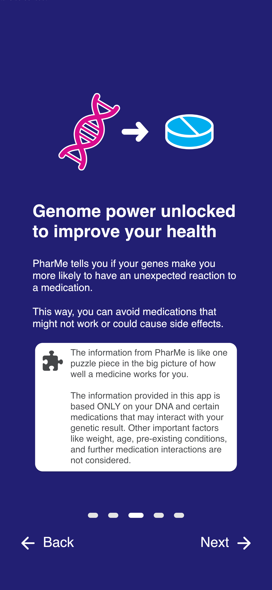
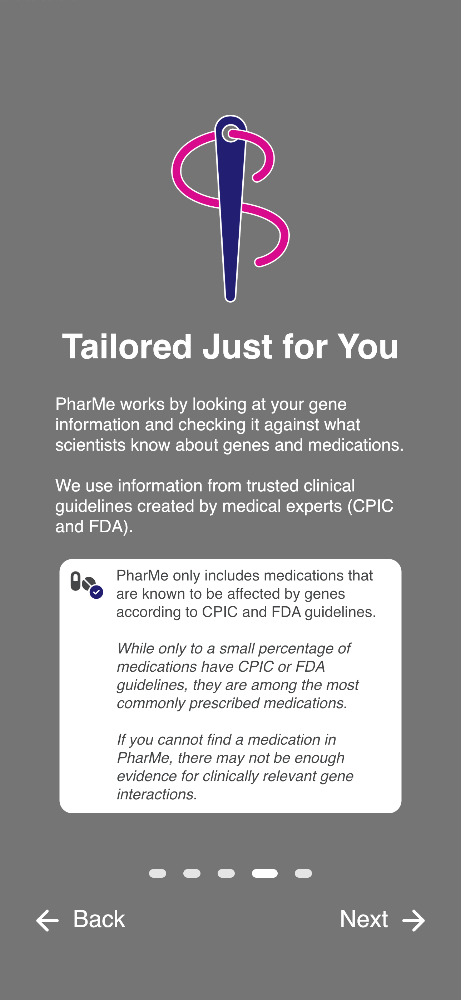
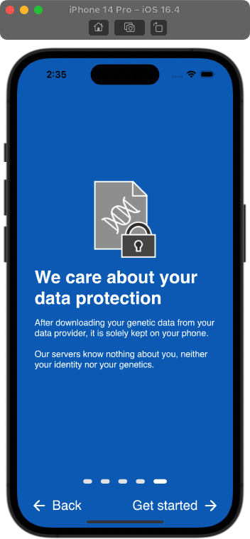
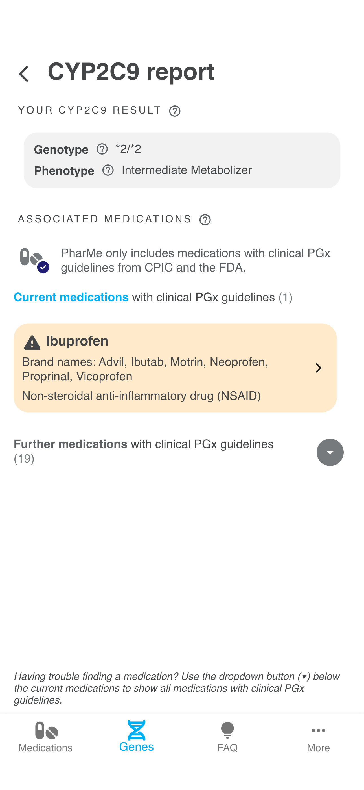
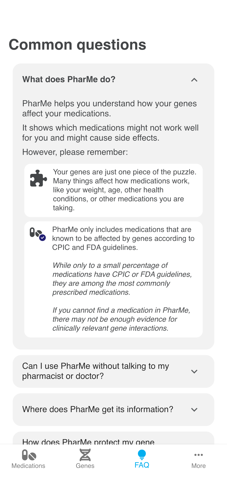
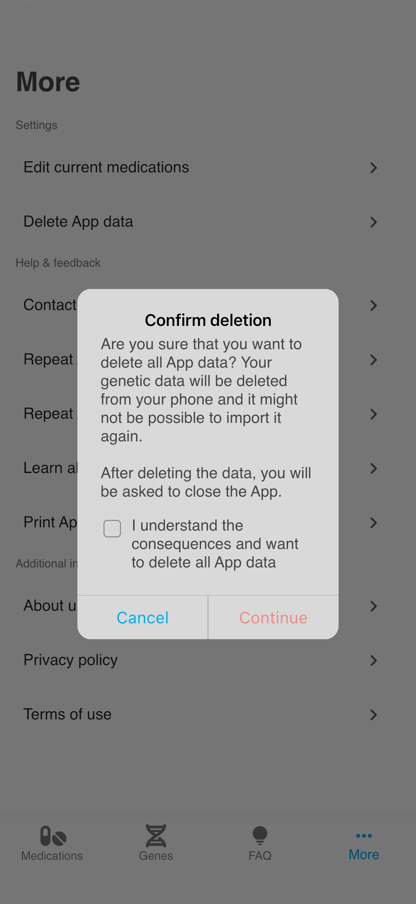

# App Screens

<!-- Including the export date for PDF export, otherwise would refer to the -->
<!-- commit history. -->

The table below lists descriptions of screens and actions that lead to them.
Actions are usually tapping (👆) or scrolling down (⏬).
If no screen number is given, the action refers to the screen in the previous
table row.

| # | Action | Screen | Description |
| - | ------ | ------ | ----------- |
| 1 | App opened the first time |  | Notice that by continuing users agree to terms (see screen 23) |
| 2 | _Continue_ 👆 |  | Login screen with "Contact us" link; will open the user's default email app with the study team address pre-filled |
| 3 | #2 _Sign in_ (correct credentials) 👆 |  | Onboarding (screen 1 of 5) |
| 4 | _Next_ 👆 |  | Onboarding (screen 2 of 5) |
| 5 | _Next_ 👆 |  | Onboarding (screen 3 of 5) |
| 6 | _Next_ 👆 |  | Onboarding (screen 4 of 5) |
| 7 | _Next_ 👆 |  | Onboarding (screen 5 of 5) |
| 8 | _Get started_ 👆 |  | Initial active medication selection |
| 9 | _Continue_ 👆 |  | Gene report, showing all genes that can be mapped to PGx guidelines |
| 10 | #10 _CYP2C9_ tile 👆 |  | Gene details; a notice about influence of other medications is shown for genes where drug-gene interactions are implemented |
| 11 | _Medications_ navigation tab 👆 |  | Medication search page |
| 12 | Filter icon 👆 |  | Available search filters |
| 13 | _Ibuprofen_ tile 👆 |  | Medication with "yellow" warning level guideline |
| 14 | _FAQ_ navigation tab 👆 |  | FAQ page |
| 15 | First FAQ list item 👆 |  | Extended FAQ item; the last item is a "Contact us" button (not visible in screenshot) in case of more questions  |
| 16 | _More_ navigation tab 👆 |  | "More" page with settings and further information; "Onboarding" will start the onboarding again (screens 5 to 10) |
| 17 | #16 _Delete app data_ 👆 |  | Deletes all app data and redirects to screen 1; continuing is only possible when the checkmark was clicked |
