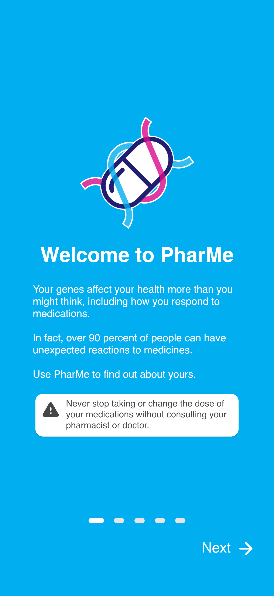
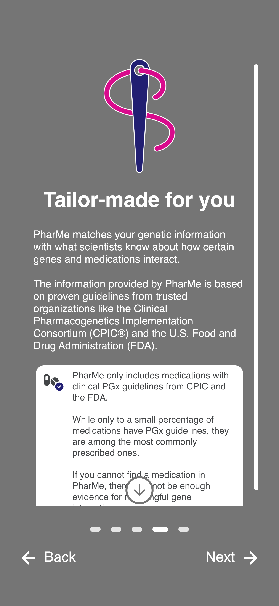
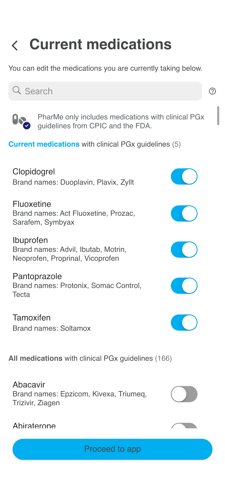
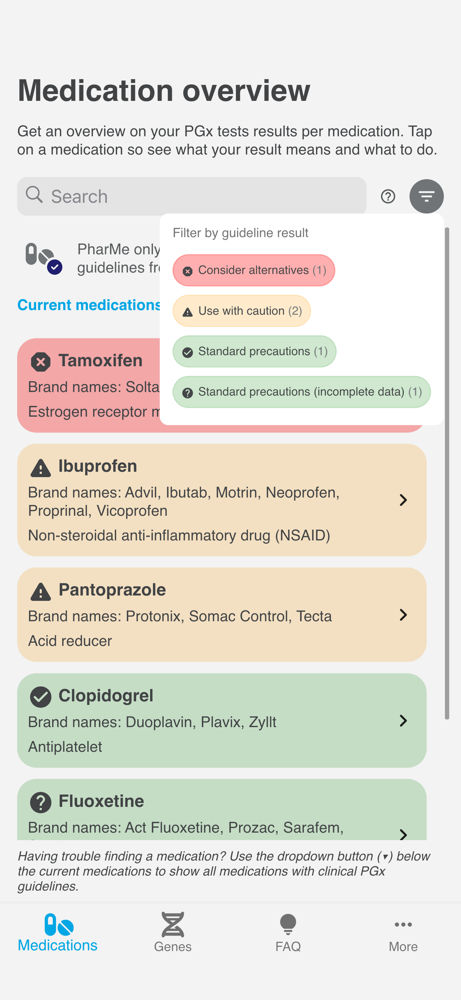
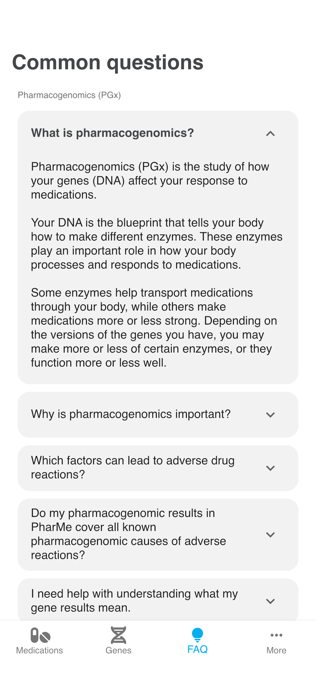
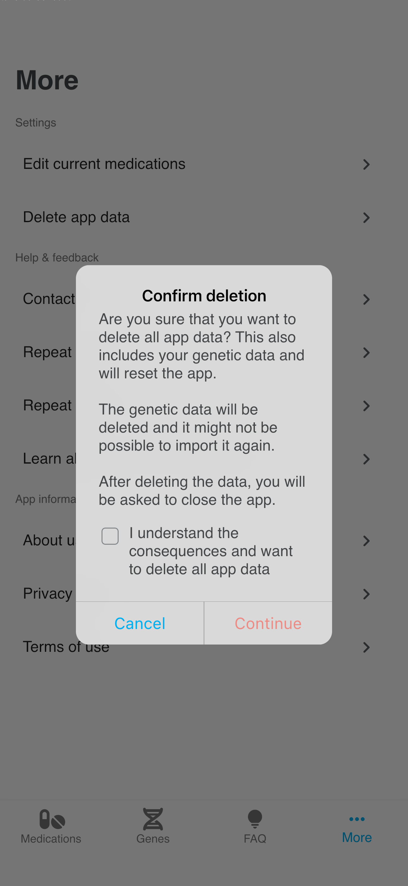

# App Screens

_The last export date is September 08, 2023. Changes applied afterwards are not_
_depicted._

<!-- Including the export date for PDF export, otherwise would refer to the -->
<!-- commit history. -->

The table below lists descriptions of screens and actions that lead to them.
Actions are usually tapping (👆) or scrolling down (⏬).
If no screen number is given, the action refers to the screen in the previous
table row.

| # | Action | Screen | Description |
| - | ------ | ------ | ----------- |
| 1 | App opened the first time |  | Login screen with data provider selection |
| 2 | _Get data_ 👆 |  | Alert for login redirect |
| 3 | _Continue_ 👆 |  | Rectedirect to Keycloak login page |
| 4 | _Sign In_ 👆 |  | Back to app, import was successful |
| 5 | _Continue_ 👆 |  | Onboarding (screen 1 of 5) |
| 6 | _Next_ 👆 |  | Onboarding (screen 2 of 5) |
| 7 | _Next_ 👆 |  | Onboarding (screen 3 of 5) |
| 8 | _Next_ 👆 |  | Onboarding (screen 4 of 5) |
| 9 | _Next_ 👆 |  | Onboarding (screen 5 of 5) |
| 10 | _Get started_ 👆 |  | Initial active drug selection |
| 11 | _Continue_ 👆 |  | Gene report, showing all genes that can be mapped to PGx guidelines |
| 12 | _CYP2D6_ tile 👆 |  | Gene details; the notice about influence of other drugs is only shown for genes where drug-gene interactions are implemented |
| 13 | _Amitriptyline_ tile 👆 |  | Drug with unknown guideline detail; shown in green since standard dosing is applied without guidelines (_note for this example: the guideline for this genotype was not published in the backend at time of screenshot creation, which is why the guideline in missing in this case_) |
| 14 | _Drugs_ navigation tab 👆 |  | Drug search page |
| 15 | _?_ icon 👆 |  | Tooltip explaining search feature; tooltips look the same on all pages  |
| 16 | Filter icon 👆 |  | Available search filters |
| 17 | _Clopidogrel_ tile 👆 |  | Drug with known guideline |
| 18 | ⬠|  | At the bottom of a drug, a link to the underlying guideline is given; this link redirects the user to the guideline website |
| 19 | Share icon (in header) 👆 |  | Create a PDF document to share with others |
| 20 | _FAQ_ navigation tab 👆 |  | FAQ page |
| 21 | First FAQ list item 👆 |  | Extended FAQ item |
| 22 | ⬠|  | "Contact us" at the end of the FAQ in case of more questions; will open the user's default email app with the development team address pre-filled |
| 23 | _More_ navigation tab 👆 |  | "More" page with settings and further information; "Onboarding" will start the onboarding again (screens 5 to 10) |
| 24 | #23 _About us_ 👆 |  | "About us" page; "Privacy policy" and "Terms of use" have the same page style (currently only lorem ipsum) |
| 25 | #23 _Delete app data_ 👆 |  | Deletes all app data and redirects to screen 1; continuing is only possible when the checkmark was clicked |
